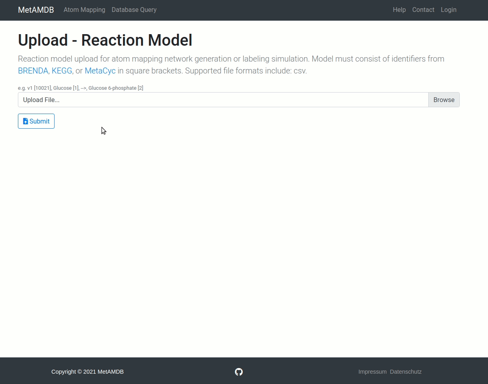

# Reaction Model

MetAMDB allows users to upload their own reaction models. The following sections will describe how to create such a model and what options are available.

[Download this example model to follow along!](../assets/example_model.csv)

<!--  -->

## File Format
Currently, the only available model format is CSV. Other file formats will be available in the future!

## File Structure
The file is structured in 4 columns: 
- [Reaction Name](/metamdb-docs/atom-mapping/reaction-model#reaction-name)
- [Substrates](/metamdb-docs/atom-mapping/reaction-model#substrates)
- [Reaction Arrow](/metamdb-docs/atom-mapping/reaction-model#reaction-arrow)
- [Products](/metamdb-docs/atom-mapping/reaction-model#products)

Each column has special fields and options.

### Reaction Name
```<ReactionName/Identifier> (<ReactionIdentifier>)```

Reaction names can be freely chosen, but require a reaction identifier from either [:link: BRENDA](https://www.brenda-enzymes.org/), [:link: KEGG](https://www.genome.jp/kegg/), or [:link: MetaCyc](https://metacyc.org/) to get a database atom mapping. `Reaction_identifiers` can either be used as the name itself or can be given in parenthesis behind the name `Name (Reaction_identifier)` .

For example:
- Reaction1 (F16ALDOLASE-RXN) - **Reaction identifier in parenthesis**
- F16ALDOLASE-RXN - **Reaction identifier as name**
- Reaction3 - **No identifier, no mapping**

### Substrates
```<MetaboliteName> (<AtomMapping>) [<MetaboliteIdentifier>] + <Metabolite...```

Metabolites names, as in the reaction column, can be freely chosen and multiple metabolites are split with a plus sign `+`.

Optional parameters include **Manual Atom Mappings**, which can be used inside parenthesis `Acetyl-CoA (ab)` after the metabolite name. The manual atom mapping needs to be in the abc format.

**Metabolite Identifiers** map metabolites to a given reaction and are required if a database atom mapping is wanted. To use metabolite identifiers square brackets can be used `Acetyl-CoA [ACETYL-COA]`. Metabolite identifiers from the above databases can be utilized ([:link: BRENDA](https://www.brenda-enzymes.org/), [:link: KEGG](https://www.genome.jp/kegg/), or [:link: MetaCyc](https://metacyc.org/)) and database specific identifiers can be mixed.

If a database reaction includes metabolites that should be removed from the atom mapping model the metabolite can be excluded by removing it from the model.

For example:
- Acetyl-CoA (ab) + CO2 (c) - **Metabolites with manual atom mappings**
- Pyruvate [Pyr] + ... - **Metabolite with metabolite identifier**

### Reaction Arrow
The following reaction arrows can be used:
- Forward: -->, ->
- Reverse: <--, <-
- Reversible: <=>, <->

### Products
Products effectively function like [Substrates](/metamdb-docs/atom-mapping/reaction-model#substrates).